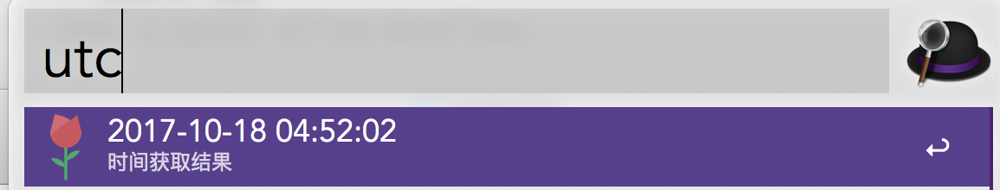
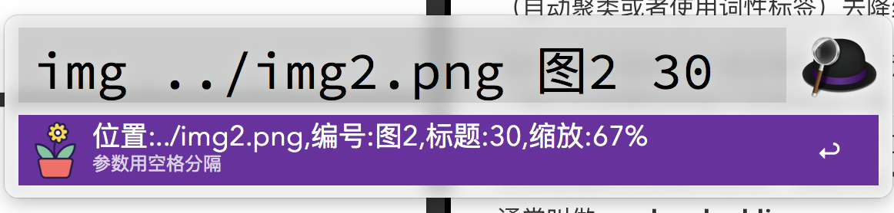

# MyWorkflows
Some original Alfred Workflows.

- GETUTC

  Get the Coordinated Universal Time with formattion to your clipboard which make it easily to finish your yml date set

 

​		**download**:[GETUTC](https://github.com/PluckySaltyfish/MyWorkflows/raw/master/download/GETUTC.alfredworkflow)

- InsertImage

  Insert an image with title in markdown editor

 
 

​		**download**:[InsertImage](https://github.com/PluckySaltyfish/MyWorkflows/raw/master/download/InsertImage.alfredworkflow)

